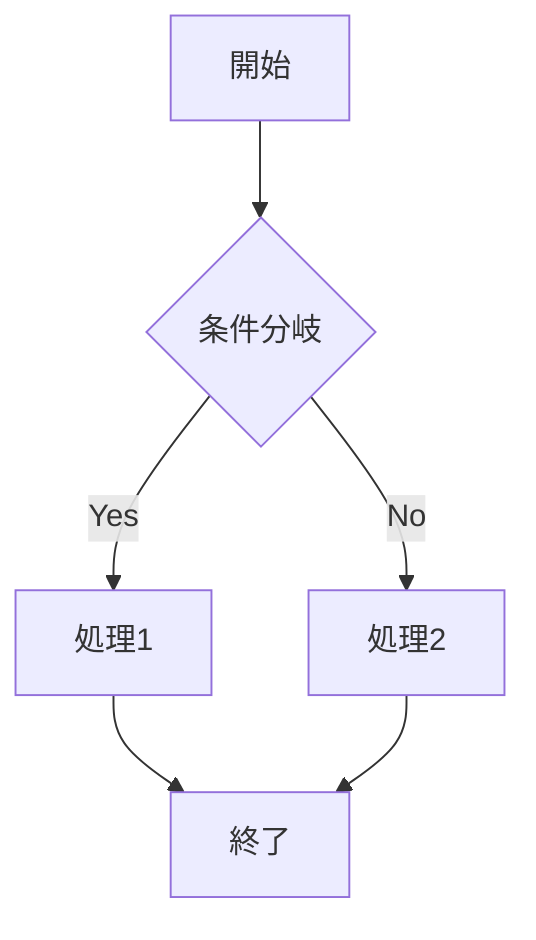

# Markdown Renderer Visual Check

このファイルは、Markdownレンダラーが各種Markdown構文を正しく描画できるか確認するためのテスト用Markdownです。

確認対象:

- CommonMark基本構文
- GitHub Flavored Markdown
- 表
- チェックボックス
- コードブロック
- インラインコード
- 数式
- Mermaid
- 脚注
- Unicode
- HTML混在
- 危険HTMLの無害化

---

## 1. 見出し

# H1 見出し

## H2 見出し

### H3 見出し

#### H4 見出し

##### H5 見出し

###### H6 見出し

通常テキストです。  
これは改行テストです。行末にスペース2つを入れた場合、改行されるべきです。

これは別段落です。

---

## 2. 強調

通常文の中に **太字**、*斜体*、***太字斜体*** を含めます。

取り消し線は GFM 対応なら ~~このように表示~~ されます。

アンダースコアによる強調も確認します。

- _italic_
- __bold__
- ___bold italic___

---

## 3. インラインコード

これは `inline code` の確認です。

日本語と混在した `const value = 42;` の確認です。

バッククォートを含むコード: `` `code inside backticks` ``

---

## 4. リンク

通常リンク:

[OpenAI](https://openai.com)

相対リンク:

[相対リンクのテスト](./docs/example.md)

メールリンク:

<test@example.com>

URL自動リンク:

https://example.com/path?query=1#hash

参照リンク:

[CommonMark][commonmark]

[commonmark]: https://spec.commonmark.org/

---

## 5. 画像

画像が表示されるか確認します。


壊れた画像:


---

## 6. 引用

> これは引用です。
>
> 複数段落の引用です。
>
> - 引用内リスト
> - 引用内リスト2
>
> ```js
> console.log("引用内コードブロック");
> ```

ネスト引用:

> Level 1
>
> > Level 2
> >
> > > Level 3

---

## 7. リスト

### 7.1 箇条書き

- item 1
- item 2
  - nested item 2-1
  - nested item 2-2
    - nested item 2-2-1
- item 3

### 7.2 番号付きリスト

1. first
2. second
3. third

### 7.3 番号のズレ

1. one
1. two
1. three

### 7.4 複合リスト

1. 親項目

   段落を含むリスト。

   ```python
   print("code in list")
   ```

2. 次の項目

   > 引用を含むリスト。

---

## 8. チェックボックス

GFM対応ならチェックボックスになります。

- [x] 完了タスク
- [ ] 未完了タスク
- [x] 日本語タスク
- [ ] `code` を含むタスク
- [ ] **強調** を含むタスク

---

## 9. 表

| 項目 | 型 | 説明 | 状態 |
|---|---:|:---:|---|
| title | string | 文書タイトル | OK |
| count | number | 件数 | OK |
| enabled | boolean | 有効化 | OK |
| notes | string[] | メモ配列 | 要確認 |

### 表内Markdown

| Markdown | 期待表示 |
|---|---|
| `code` | インラインコード |
| **bold** | 太字 |
| [link](https://example.com) | リンク |
| ~~delete~~ | 取り消し線 |

---

## 10. コードブロック

### JavaScript

```js
function add(a, b) {
  return a + b;
}

console.log(add(2, 3));
```

### TypeScript

```ts
type User = {
  id: number;
  name: string;
  active: boolean;
};

const user: User = {
  id: 1,
  name: "Alice",
  active: true,
};
```

### Bash

```bash
npm install
npm run build
npm test
```

---

## 11. 数式

インライン数式: $E = mc^2$

別のインライン数式: $a^2 + b^2 = c^2$

$$
E = mc^2
$$

$$
\frac{1}{2}
$$

### 11.10 リストと引用内の数式

> 1. 数式:
>
>    $$
>    x = y + z
>    $$
>
>    引用終了

### 11.11 ベクトルノルム

インライン数式: $\|\mathbf{x}\|_2 = \sqrt{x_1^2 + x_2^2 + x_3^2}$

---

## 12. Mermaid



---

## 13. 脚注

これは脚注のテストです。[^note1]

[^note1]: これは脚注1です。**Markdown** を含みます。

---

## 14. Unicode / 日本語 / 絵文字

日本語:

> これは日本語の文章です。句読点、全角文字、英数字ABC123を含みます。

絵文字:

- 😀
- 🚀
- ✅
- ⚠️
- 🧪

混在文:

日本語 English 123 🚀

---

## 15. HTML混在

以下はレンダラー方針によって結果が変わります。

<div class="note">
  <strong>HTML block</strong>
  <p>raw HTMLを許可する設計なら表示されます。</p>
</div>

<span style="color:red">style属性を許可するかは要方針決定</span>

---

## 16. 危険HTML・XSS確認

<script>
alert("XSS script tag");
</script>


[危険リンク](javascript:alert('XSS javascript URL'))

<iframe src="https://example.com"></iframe>

---

## 17. Unicode / 日本語 / 絵文字

日本語:

> これは日本語の文章です。句読点、全角文字、英数字ABC123を含みます。

絵文字:

- 😀
- 🚀
- ✅
- ⚠️
- 🧪

結合文字:

- café
- café

RTL文字:

- العربية
- עברית

混在文:

日本語 English العربية 123 🚀

---

## 18. エスケープ確認

Markdown記号をそのまま表示したい場合:

\*これは斜体にならないはず\*

\# これは見出しにならないはず

\[これはリンクにならないはず\](https://example.com)

バックスラッシュ:

\\

---

## 19. 水平線

`---` / `***` / `___` は、それぞれ異なる水平線として表示されます。

`---` の水平線:

---

`***` の水平線:

***

`___` の水平線:

___

---

## 20. ネスト混合テスト

> 引用開始
>
> 1. 番号付きリスト
> 2. 番号付きリスト
>
>    - 箇条書き
>    - 箇条書き
>
>    ```js
>    const nested = true;
>    ```
>
>    数式:
>
>    $$
>    x = y + z
>    $$
>
> 引用終了

---

## 21. 長い表

| No | Name | Score | Status | Note |
|---:|---|---:|---|---|
| 1 | Alpha | 98 | pass | normal |
| 2 | Beta | 87 | pass | normal |
| 3 | Gamma | 76 | pass | normal |
| 4 | Delta | 65 | warn | check |
| 5 | Epsilon | 54 | fail | retry |
| 6 | Zeta | 43 | fail | retry |
| 7 | Eta | 32 | fail | retry |
| 8 | Theta | 21 | fail | retry |
| 9 | Iota | 10 | fail | retry |
| 10 | Kappa | 0 | fail | edge case |

---

## 22. 期待される合否基準

このMarkdownを表示して、以下を確認してください。

| 項目 | PASS条件 | FAIL条件 |
|---|---|---|
| 基本文法 | 見出し・リスト・引用が崩れない | 構造が潰れる |
| GFM | 表・チェックボックスが表示される | 表がただのテキストになる |
| 数式 | 数式が描画される | `$...$` がそのまま出る、またはクラッシュ |
| Mermaid | 図が描画される | fenceのまま、またはクラッシュ |
| 壊れた数式 | エラー表示または無視 | ページ全体が落ちる |
| 壊れたMermaid | エラー表示または無視 | ページ全体が落ちる |
| XSS | alertが出ない | alertが出る |
| Unicode | 文字化けしない | 文字化けする |

---

## 23. 変数表: 数式確認用

| 記号 | 意味 | 単位 | 定義 | 定義域/前提 | 型 |
|---|---|---:|---|---|---|
| \(E\) | エネルギー | J | \(E=mc^2\) | \(m \ge 0\) | スカラー |
| \(m\) | 質量 | kg | 任意の非負実数 | \(m \ge 0\) | スカラー |
| \(c\) | 光速 | m/s | 約 \(2.998\times10^8\) | 真空中 | スカラー |
| \(A\) | 行列 | なし | \(3\times3\) 行列 | 実数成分 | 行列 |
| \(\mathbf{x}\) | ベクトル | なし | 列ベクトル | \(\mathbf{x}\in\mathbb{R}^3\) | ベクトル |
| \(P(H\mid D)\) | 事後確率 | なし | ベイズ更新 | \(P(D)>0\) | 確率 |

---

## 24. 単位チェック例

式:

$$
E = mc^2
$$

単位:

$$
[mc^2] = \mathrm{kg}\cdot\left(\frac{\mathrm{m}}{\mathrm{s}}\right)^2
= \mathrm{kg}\cdot\frac{\mathrm{m}^2}{\mathrm{s}^2}
= \mathrm{J}
$$

よって左辺 \(E\) の単位 J と一致します。

---

## 25. 終端確認

この行が表示されていれば、ファイル末尾まで正常に読めています。

**END OF MARKDOWN RENDERER VISUAL CHECK**Z
