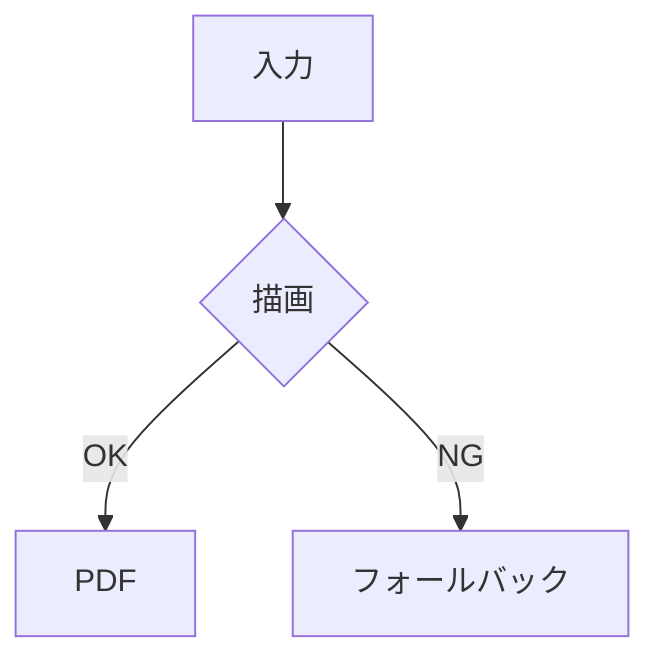

# miniPDF 表示一致テスト

このファイルは、**右ペインのプレビュー**と**保存した PDF** の見た目が揃っているかを確認するためのテスト用 Markdown です。

## 確認したい項目

- 見出しの上下余白
- 箇条書きの字下げ
- Mermaid 図の配置
- 表の枠とセル配置
- 引用ブロックの左罫線

## 見出し

### 小見出し

通常の段落です。ここでは単一改行の扱いと、段落の余白を確認します。

改行した次の行も、PDF で同じように見えることを確認してください。

## 半角入力の改行

ASCII input
next line

この2行は、Enter で 1 行進んだときの見え方を確認するためのものです。

## 箇条書き

- 親項目
  - 子項目その1
  - 子項目その2
- 別の親項目

1. 番号付き項目
2. もう一つの項目
3. 最後の項目

## Mermaid



## 表

| 項目 | 値 |
|------|----|
| 左   | 1  |
| 右   | 2  |

## 引用

> この引用ブロックは、左罫線と背景色のずれを確認するためのものです。
> 複数行になったときの見え方も確認してください。

---

## コード

```ts
const message = 'preview consistency';
console.log(message);
```
